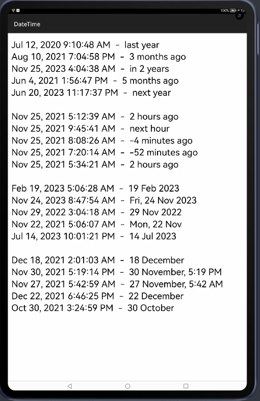

# NaturalDateFormat

A HMOS library to format dates.RelativeDateFormat formats date as relative (4 months ago, today, next year), AbsoluteDateFormat formats date as absolute (Monday, 4:32 PM, June 10).

## Source
Inspired by [ZieIony/NaturalDateFormat](https://github.com/ZieIony/NaturalDateFormat) 

## Feature
This library provides feature to format dates.


## Dependency
1. For using naturaldateformat module in sample app, include the source code and add the below dependencies in entry/build.gradle to generate hap/support.har.
```groovy
	dependencies {
                implementation fileTree(dir: 'libs', include: ['*.jar', '*.har'])
                testImplementation 'junit:junit:4.13'
                ohosTestImplementation 'com.huawei.ohos.testkit:runner:1.0.0.100'
                implementation project(path: ':naturaldateformat')
        }
```
2. For using naturaldateformat in separate application using har file, add the har file in the entry/libs folder and add the dependencies in entry/build.gradle file.
```groovy
	dependencies {
                implementation fileTree(dir: 'libs', include: ['*.jar'])
                testImplementation 'junit:junit:4.13'
                compile 'joda-time:joda-time:2.9.4'
        }
```


## Usage

#### Xml

```xml
        <ScrollView
                ohos:height="match_parent"
                ohos:width="match_parent">
                <Text
                    ohos:id="$+id:text_helloworld"
                    ohos:height="match_content"
                    ohos:width="match_parent"
                    ohos:text="Hello World"
                    ohos:text_size="30vp"
                    ohos:background_element="$graphic:background_ability_main"
                    ohos:layout_alignment="horizontal_center"
                    >
                </Text>
            </ScrollView>
```
#### Java
```java
RelativeDateFormat relFormat = new RelativeDateFormat(context,NaturalDateFormat.DATE);
        AbsoluteDateFormat absFormat = new AbsoluteDateFormat(context,NaturalDateFormat.DATE | NaturalDateFormat.HOURS | NaturalDateFormat.MINUTES);
        relFormat.format(new Date().getTime());
        absFormat.format(new Date().getTime());
```


